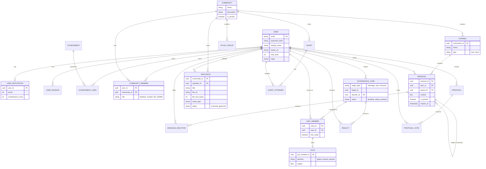

# Center7 - Database Entity-Relationship Diagram (ERD)

This document outlines the enterprise-grade, normalized relational database schema for Center7. It includes all core tables, relationships, indexes, and constraints. 

## Standard Columns
As per the enterprise architecture requirements, *every* table in the database includes the following standard audit columns (omitted from the visual diagram below for brevity, but strictly enforced in the schema):
- `id` (UUID, Primary Key)
- `created_at` (Timestamp, Default: NOW())
- `updated_at` (Timestamp, Auto-updates on modification)
- `deleted_at` (Timestamp, Nullable, Used for soft-deletes)
- `version` (Integer, Default: 1, Used for optimistic locking)

## Visual ERD (Mermaid)

## Detailed Tables & Constraints

### 1. Identity & Access
**`users`**
- `email` (VARCHAR, Unique, Indexed)
- `password_hash` (VARCHAR)
- `display_name` (VARCHAR)
- `trust_level` (INT, Default 1)
- `status` (ENUM: 'active', 'suspended', 'banned')

**`user_reputations`**
- `user_id` (UUID, Foreign Key -> users.id, Unique)
- `points` (INT, Default 0)
- `votes_cast` (INT, Default 0)
- `successful_reports` (INT, Default 0)

### 2. Community Structure
**`communities`**
- `name` (VARCHAR, Indexed for search)
- `description` (TEXT)
- `visibility` (ENUM: 'public', 'private', 'invite_only')

**`community_members`**
- `user_id` (UUID, Foreign Key -> users.id)
- `community_id` (UUID, Foreign Key -> communities.id)
- `role` (ENUM: 'initiate', 'member', 'trusted', 'elder' - *Note: No admin roles*)
- *Constraint*: UNIQUE(user_id, community_id)
- *Index*: (community_id, user_id)

**`channels`**
- `community_id` (UUID, Foreign Key -> communities.id)
- `name` (VARCHAR)
- `type` (ENUM: 'text', 'voice', 'announcement')
- `is_locked` (BOOLEAN)

### 3. Communication
**`messages`**
- `channel_id` (UUID, Foreign Key -> channels.id, Indexed)
- `user_id` (UUID, Foreign Key -> users.id)
- `parent_message_id` (UUID, Nullable, Foreign Key -> messages.id) - *For threads*
- `content` (TEXT)
- `is_pinned` (BOOLEAN, Default false)
- `expires_at` (TIMESTAMP, Nullable) - *For disappearing messages*
- *Index*: (channel_id, created_at DESC)

### 4. Resources
**`resources`**
- `community_id` (UUID, Foreign Key -> communities.id)
- `uploader_id` (UUID, Foreign Key -> users.id)
- `title` (VARCHAR, Indexed for full-text search)
- `file_url` (VARCHAR)
- `file_size_bytes` (BIGINT)
- `mime_type` (VARCHAR)
- `scan_status` (ENUM: 'pending', 'clean', 'flagged')

### 5. Decentralized Governance
**`governance_cases`**
- `target_type` (ENUM: 'user', 'message', 'resource', 'community')
- `target_id` (UUID, Indexed)
- `reporter_id` (UUID, Foreign Key -> users.id)
- `reason` (TEXT)
- `status` (ENUM: 'gathering_jury', 'voting', 'appealed', 'resolved')

**`jury_members`**
- `case_id` (UUID, Foreign Key -> governance_cases.id)
- `user_id` (UUID, Foreign Key -> users.id)
- `selected_at` (TIMESTAMP)
- *Constraint*: UNIQUE(case_id, user_id)

**`votes`**
- `jury_member_id` (UUID, Foreign Key -> jury_members.id, Unique)
- `decision` (ENUM: 'action', 'no_action', 'abstain')
- `weight` (DECIMAL, based on user trust_level at time of vote)
- `justification` (TEXT)

**`penalties`**
- `user_id` (UUID, Foreign Key -> users.id, Indexed)
- `case_id` (UUID, Foreign Key -> governance_cases.id)
- `type` (ENUM: 'warning', 'suspension', 'ban', 'rep_deduction')
- `expires_at` (TIMESTAMP, Nullable)

### 6. Indexing Strategy
To meet the requirement of serving millions of users and sub-200ms API response times:
1. **Primary Keys**: B-Tree indexes automatically created on all `id` UUID columns.
2. **Foreign Keys**: B-Tree indexes applied to all FKs to prevent full-table scans during JOIN operations (e.g., `messages.channel_id`, `community_members.user_id`).
3. **Soft Deletes**: Partial indexes utilized where applicable (e.g., `CREATE INDEX idx_active_messages ON messages(channel_id) WHERE deleted_at IS NULL`).
4. **Search**: GiST/GIN indexes configured on `resources.title`, `communities.name`, and `messages.content` for rapid full-text search capabilities (to be mirrored in Elasticsearch/Meilisearch).
5. **Pagination**: Composite indexes for cursor-based pagination (e.g., `INDEX(channel_id, created_at DESC)` for message loading).

### 7. Core Constraints
1. **No Admin Enforcement**: The schema strictly lacks any global "is_admin" flag on the user table or "admin" roles in community_members. Elevated actions are strictly bound to the `governance_cases` and `votes` tables.
2. **Referential Integrity**: 
   - `ON DELETE RESTRICT` for users, preventing accidental deletion of users tied to audit history (votes, cases).
   - `ON DELETE CASCADE` for things like `messages` if a `channel` is deleted.
3. **Optimistic Locking**: Every UPDATE query must include `WHERE id = ? AND version = ?` and increment the version to prevent race conditions during parallel governance voting or resource uploads.
