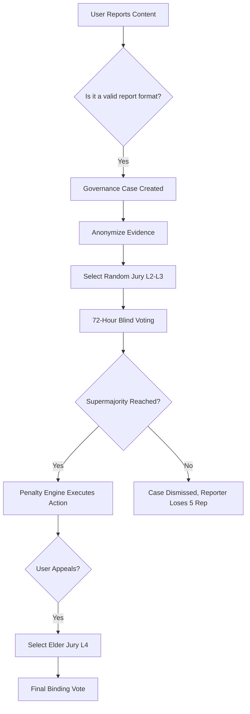

# Center7 - Decentralized Governance Engine

## 1. Core Philosophy: The "No Admin" Rule
Center7 operates on a strict, mathematically driven decentralized governance model. There are no permanent administrators, moderators, or super-users. Every action that would traditionally require an administrator—such as banning a user, removing a malicious resource, or updating a community guideline—is handled exclusively through Reputation-Weighted Voting, Random Juries, and Automated Penalty execution.

## 2. Reputation System
Reputation is the currency of trust within Center7. It is a quantifiable score that reflects a user's positive contribution to the platform.

### Earning Reputation (+)
- **Content Contribution:** Uploading resources that receive positive community ratings.
- **Helpfulness:** Having answers marked as "Accepted" or highly upvoted in study groups.
- **Civic Duty:** Participating in Juries where the user's vote aligns with the final majority consensus (proving they are reading and evaluating fairly).
- **Proposals:** Successfully passing a community proposal.

### Losing Reputation (-)
- **Penalties:** Being found guilty in a Governance Case.
- **Frivolous Reporting:** Submitting reports that are unanimously dismissed by juries.
- **Inactivity Decay:** Small gradual decay for long-term inactivity to prevent hoarding of voting power.

## 3. Trust Levels
Reputation points map to algorithmic **Trust Levels**, which unlock platform privileges and determine voting weight.

| Level | Name | Reputation Required | Privileges & Voting Weight |
|---|---|---|---|
| L1 | Initiate | 0 - 100 | Standard messaging. Cannot vote or report. (Weight: 0) |
| L2 | Member | 101 - 1,000 | Can report, upload files (up to 50MB). Eligible for standard juries. (Weight: 1.0) |
| L3 | Trusted | 1,001 - 5,000 | Can create communities. Upload files (up to 250MB). (Weight: 1.5) |
| L4 | Elder | 5,001+ | Can submit Proposals. Eligible for Appeal Juries. (Weight: 2.0) |

## 4. The Random Jury System
When a report is generated (e.g., spam, harassment, plagiarism), it becomes a **Governance Case**.

### Juror Selection Algorithm
1. **Pool Generation:** The system selects a random pool of active, eligible users (L2 or higher).
2. **Conflict of Interest Filtering:** Excludes users in the same immediate study group or with high historical interaction with the reported user.
3. **Anonymization:** The names of the reporter and the reported are scrubbed from the evidence presented to the jury to eliminate personal bias.
4. **Jury Size:** Scales based on severity. Minor offense (spam) = 5 Jurors. Severe offense (ban request) = 15 Jurors.

## 5. Voting Mechanics
- **Blind Voting:** Jurors cannot see how others are voting until the case is resolved.
- **Decisions:** Jurors vote `Action Required` or `No Action`.
- **Weighting:** Votes are tallied by multiplying the vote by the juror's Trust Level weight (e.g., an Elder's vote counts as 2, a Member's counts as 1).
- **Threshold:** A supermajority (typically 66% of weighted votes) is required to execute a penalty.
- **Time Limits:** Juries have 48 hours to vote. Failure to vote penalizes the juror's reputation.

## 6. Automated Penalty Engine
If a case reaches the `Action Required` threshold, the Penalty Engine automatically executes the verdict without human intervention.
- **Minor:** Content removal + Warning notification.
- **Moderate:** 7-day read-only suspension + 15% Reputation deduction.
- **Severe:** Permanent platform ban + Complete deletion of specific malicious resources.

## 7. Appeals Process
Errors in judgment can occur. Penalized users have the right to one automatic appeal.
- **The Supreme Jury:** An appeal bypasses the standard jury and is assigned strictly to a larger pool of randomly selected **L4 (Elders)**.
- **The Stakes:** If the Supreme Jury overturns the penalty, the user's reputation is restored. If the appeal is rejected, an additional "Frivolous Appeal" reputation deduction is applied.

## 8. Proposal System (The Constitution)
Communities govern themselves through a living constitution.
- **Drafting:** L4 Elders can draft Proposals (e.g., "Ban AI-generated essays in the Computer Science community").
- **Community Vote:** The proposal is broadcast to all active members of that community.
- **Enactment:** If it passes a 75% approval threshold over a 7-day voting period, it is officially appended to the community guidelines, which future Juries are mathematically bound to uphold when reviewing cases.

---

### Workflow Diagram

